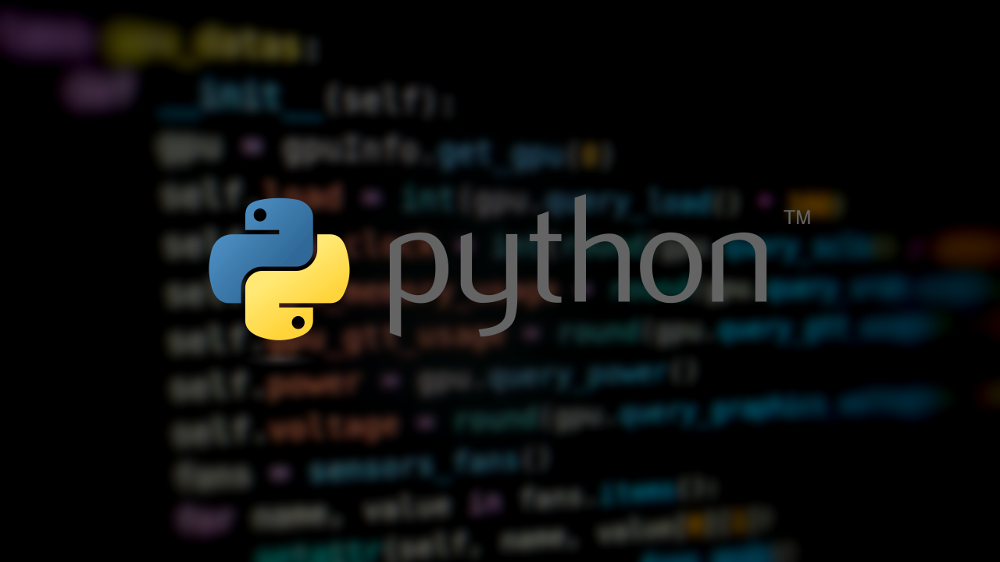

<div align="center">
  
</div>

---

Purpose

This folder contains Python exercises and solutions for:
- Training and improving Python programming skills
- Solving 42 school challenges in Python
- Experimenting with algorithmic problems
- Building reusable utilities and libraries

---

## Learning Goals

- Master Python fundamentals and best practices
- Develop strong problem-solving skills through algorithmic challenges
- Improve code efficiency and readability
- Apply object-oriented programming principles
- Explore Python's standard library and built-in functions

---

## Structure

```
python/
├── README.md          # This file
├── exercises/         # General Python exercises
├── utils/             # Reusable utility functions and libraries
└── experiments/       # Prototypes and explorations
```

---

## Key Topics

**Fundamentals**
- Data types and structures (lists, dicts, sets, tuples)
- Functions and comprehensions
- String manipulation
- File I/O and pathlib

**Intermediate**
- Object-oriented programming (classes, inheritance, polymorphism)
- Decorators and generators
- Exception handling
- Working with modules and packages

**Advanced**
- Algorithms and data structures
- Performance optimization
- Testing and debugging
- Design patterns

---

## Useful Resources

- [Python Official Documentation](https://docs.python.org/3/)
- [Codedex](https://www.codedex.io/)
- [FreeCodeCamp](https://www.freecodecamp.org/)
- [W3Schools](https://www.w3schools.com/python/)
- [Codecademy](https://www.codecademy.com/learn/learn-python-3)

---

## Running Solutions

To run a Python file:
```bash
python filename.py
```

For a specific script with arguments:
```bash
python script.py arg1 arg2
```

---

## Notes

- Solutions are written for Python 3.7+
- Code follows PEP 8 style guidelines
- Each challenge/exercise includes comments explaining the approach

---
